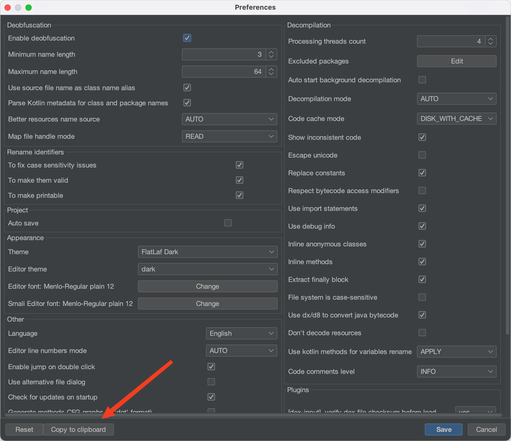

# jadx_conf

The main purpose of this tool is conversion of configuration files from json format
into ["JCommander"](https://jcommander.org/#_syntax) format in order to pass these configuration options to `jadx-cli`
later on.

☢️ **It's a dirty workaround. Please, upvote [this](https://github.com/skylot/jadx/issues/1731) issue.** ☢️

---

```shell
Usage: jadx_conf.py <json config> [additional flags]
Examples:
	jadx_conf.py jadx-example-gui-config.json -e -d app-sources
```

JSON configuration can be easily obtained from the `File->Preferences` menu


## Some technical details

This script uses the following mapping between json and cli options:

- **skipResources**: `--no-res`
- **skipSources**: `--no-src`
- **exportAsGradleProject**: `--export-gradle`
- **threadsCount**: `--threads-count`
- **decompilationMode**: `--decompilation-mode`
- **showInconsistentCode**: `--show-bad-code`
- **useImports**: `--no-imports`
- **debugInfo**: `--no-debug-info`
- **addDebugLines**: `--add-debug-lines`
- **inlineAnonymousClasses**:  `--no-inline-anonymous`
- **inlineMethods**:   `--no-inline-methods`
- **extractFinally**: `--no-finally`
- **replaceConsts**: `--no-replace-consts`
- **escapeUnicode**: `--escape-unicode`
- **respectBytecodeAccessModifiers**: `--respect-bytecode-access-modifiers`
- **deobfuscationOn**: `--deobf`
- **deobfuscationMinLength**:  `--deobf-min`
- **deobfuscationMaxLength**:  `--deobf-max`
- **deobfuscationMapFileMode**: `--deobf-cfg-file-mode`
- **deobfuscationUseSourceNameAsAlias**:  `--deobf-use-sourcename`
- **deobfuscationParseKotlinMetadata**: `--deobf-parse-kotlin-metadata`
- **resourceNameSource**:     `--deobf-res-name-source`
- **useKotlinMethodsForVarNames**: `--use-kotlin-methods-for-var-names`
- **renameFlags**: `--rename-flags`
- **fsCaseSensitive**: `--fs-case-sensitive`
- **cfgOutput**: `--cfg`
- **rawCfgOutput**: `--raw-cfg`
- **fallbackMode**: `--fallback`
- **useDx**: `--use-dx`
- **commentsLevel**: `--comments-level`
- **pluginOptions.java-convert.d8-desugar:** `-Pjava-convert.d8-desugar=<value>`
- **pluginOptions.java-convert.mode**: `-Pjava-convert.mode=<value>`
- **pluginOptions.dex-input.verify-checksum:** `-Pdex-input.verify-checksum=<value>`
